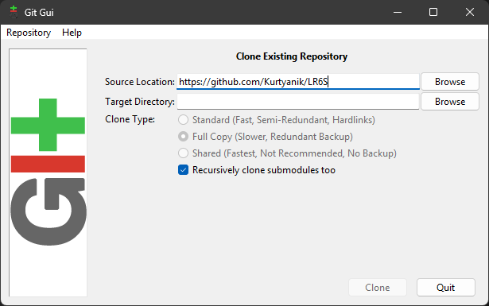
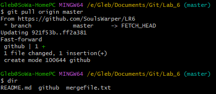
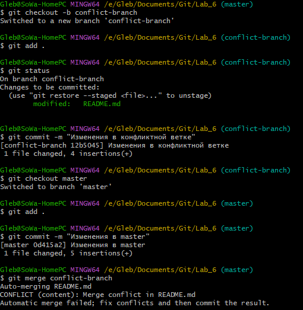
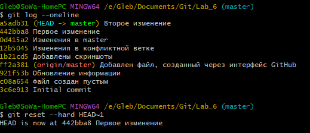
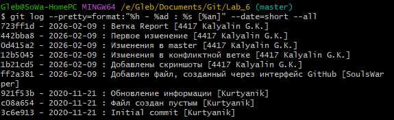

# LR6
Лабораторная работа №6

**Цель лабораторной работы:** изучение базовых возможностей системы управления версиями, опыт работы с Git API, опыт работы с локальным и удалённым репозиторием.

## Ход работы:

Переходим по ссылке https://github.com/Kurtyanik/LR6/ В правом верхнем углу страницы нажимаем кнопку "Fork. Далее копируем форк в локальный репозиторий. Для этого я воспользовался  Git GUI. 

<div align="center">

<p>Рисунок 1 - Клонирование репозитория</p>
</div>

Далее добавляем файл через через интерфейс GitHub (название файла - github). Потом вытягиваем его в локальный репозиторий:

<div align="center">

<p>Рисунок 2 - git pull</p>
</div>


Получаем историю для каждой ветви:

<div align="center">

<p>Рисунок 3 - История</p>
</div>

Смотрим последние изменения:

<div align="center">

<p>Рисунок 4 - Изменения</p>
</div>

Создаем новую ветвь conflict-branch и создаём конфликт слияния, пытаясь сделать merge:

<div align="center">

<p>Рисунок 5 - Конфликт</p>
</div>

Удаляем ненужную ветвь для решения конфликта слияния:

<div align="center">

<p>Рисунок 6 - Решение конфликта</p>
</div>

Делаем серию коммитов:

<div align="center">

<p>Рисунок 7 - Первый коммит из серии</p>
</div>

<div align="center">

<p>Рисунок 8 - Второй коммит из серии</p>
</div>


Удаляем последний коммит с помощью revert и проверяем результат:

<div align="center">

<p>Рисунок 9 - Результат удаления коммита</p>
</div>


Получаем историю операций:

<div align="center">

<p>Рисунок 10 - История операций</p>
</div>

## Вывод

Изучил базовые возможности системы управления версиями, получил опыт работы с Git API и локальным и удалённым репозиторием.

## Лог команд:

```bash

# Работа с ветками
git checkout -b conflict-branch
git checkout master
git merge conflict-branch
git branch -d conflict-branch

# Откат коммита
git reset --hard

# Отчет
git checkout -b report

# ... работа над README.md ...
git add .
git commit -m "сообщение"
git checkout master
git merge report

# Публикация
git push origin master
